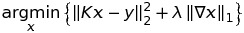
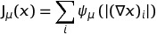
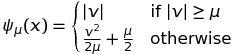
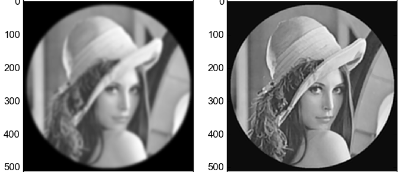
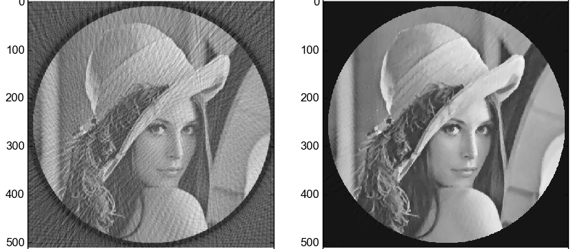

# Chambolle-Pock algorithm for Total Variation minimization

This repository is a Python implementation of the Chambolle-Pock algorithm <a href="#cp">[1]</a> for minimizing an objective function with Total Variation (TV) regularization.
It is mainly written for a didactic purpose.

Two examples are implemented :
* Deconvolution
* Tomographic reconstruction

There is also an implementation of conjugate gradient using a smoothed TV described in <a href="#weiss08">[2]</a>.

## Installation

Simply download and execute the sample scripts.
For tomographic reconstruction, the [ASTRA toolbox](https://github.com/astra-toolbox/astra-toolbox) version **1.6** should be installed beforehand.

## Usage

The file CP.py implements the Chambolle-Pock algorithm for minimizing

where *K* can be any linear operator (here, convolution or tomographic projection).

The file CG.py implements a conjugate gradient algorithm for solving the previous problem, where the TV  is approximated by

with

Both of these files can be executed.

The other files contain functions implementing various operators.

[1] <a id="cp" href="https://hal.archives-ouvertes.fr/hal-00490826/document">
Antonin Chambolle, Thomas Pock, *A First-Order Primal-Dual Algorithm for Convex Problems with Applications to Imaging*, 2011,
Journal of Mathematical Imaging and Vision, Vol. 40 Issue 1, pp. 120-145 </a>

[2] <a id="weiss08" href="http://www.math.univ-toulouse.fr/~weiss/Publis/SIAM_JSC09_PWEISS.pdf">
Pierre Weiss, Laure Blanc-Féraud, and Gilles Aubert,
*Efficient Schemes for Total Variation Minimization Under Constraints in Image Processing*, 2008,
SIAM J. Sci. Comput., 31(3), 2047–2080
</a>
